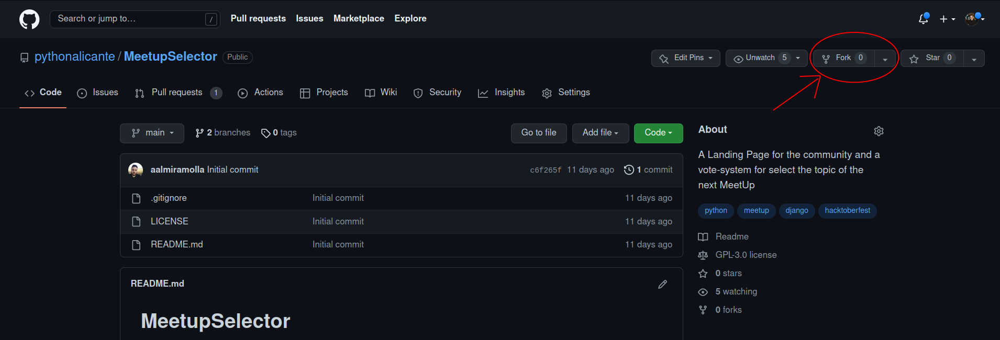

# Contributor's Guide

'HOW TO CONTRIBUTE TO OPEN SOURCE' accepts PR's (pull requests) from **newbies**
only. This is to help **newbies** get familiar with the contribution processes.

Issues can be submitted by anyone - either seasoned developers or newbies.

**Contents**

- [Getting Started](#getting-started)
- [Contributing](#contributing)
- [Submitting a Pull Request](#submitting-a-pull-request)

## Getting Started

1.  Fork the project on GitHub.
    [Help Guide to Fork a Repository](https://help.github.com/en/articles/fork-a-repo/).

    

2.  Clone the project.
    [Help Guide to Clone a Repository](https://help.github.com/en/articles/cloning-a-repository)

3.  Create a branch specific to the issue you are working on.

    ```shell
    git checkout -b feat/summary-of-feature
    git checkout -b update/readme-file
    ...
    ```

    For clarity, name your branch `update/xxx`, `feat/xxx` or `fix/xxx`. The `xxx` is a short description of the changes you're making.

## Contributing

1.  Open up the project in your favorite text editor, select the file you want to contribute to, and make your changes.

2.  Add your modified files to Git, [How to Add, Commit, Push, and Go](http://readwrite.com/2013/10/02/github-for-beginners-part-2/).

    ```shell
    git add path/to/filename.ext
    ```

    You can also add all unstaged files using:

    ```shell
    git add .
    ```

    **Note:** using a `git add .` will automatically add all files. You can do a `git status` to see your changes, but do it **before** `git add`.

3.  Commit your changes using a descriptive commit message.

    ```shell
    git commit -m "Brief Description of Commit"
    ```

4.  Push your commits to your GitHub Fork:

    ```shell
    git push -u origin branch-name
    ```

## Submitting a Pull Request

Within GitHub, visit this main repository and you should see a banner suggesting that you make a pull request. While you're writing up the pull request, you can add `Closes #XXX` in the message body where `#XXX` is the issue you're fixing. Therefore, an example would be `Closes #42` would close issue
`#42`.

It is also recommended to add a **list with the description of all commits** included in PR.

When possible, add a **link to the task/ticket/issue description**. It can be a link to task in GH project board, Jira ticket, etc...

[What is a Pull Request?](https://yangsu.github.io/pull-request-tutorial/)

If you decide to fix an issue, it's advisable to check the comment thread to see if there's somebody already working on a fix. If no one is working on it, kindly leave a comment stating that you intend to work on it. By doing that, other people don't accidentally duplicate your effort.

In a situation where somebody decides to fix an issue but doesn't follow up for a particular period of time, say 2-3 weeks, it's acceptable to still pick up the issue but make sure that you leave a comment.

*Note*: Every open-source project has a **CONTRIBUTING.md** file, please make sure to read this before you open up a pull request; otherwise, it may be rejected. However, if you do not see any CONTRIBUTING.md file, you can send a pull request but do it in a descriptive manner.
